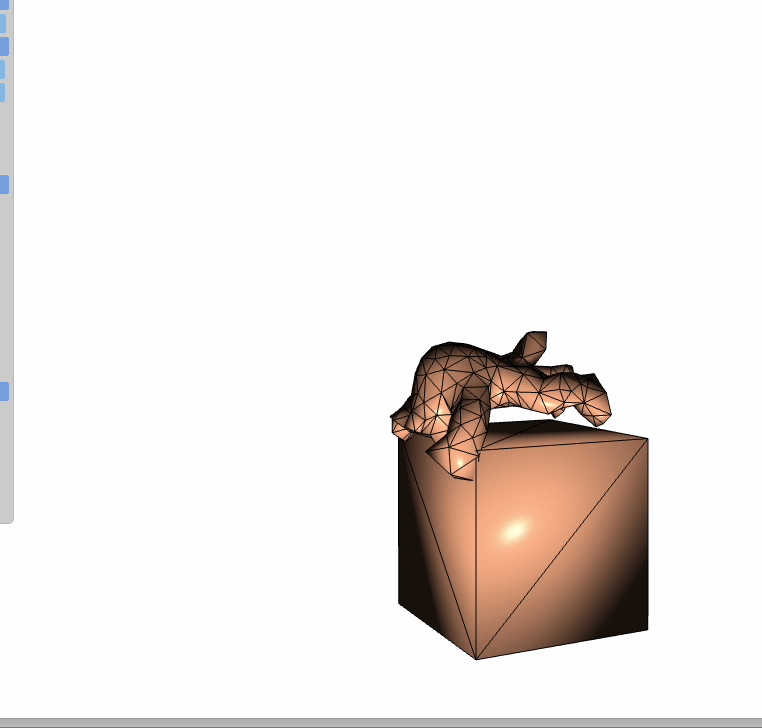

# Penalty-Force-Collision-Response

## Introduction
The algorithm is mainly based on paper [Consistent Penetration Depth Estimation for Deformable Collision Response](https://cg.informatik.uni-freiburg.de/publications/2004_VMV_penetrationDepth.pdf) & [Optimized spatial hashing for collision detection of deformable objects](https://www.researchgate.net/profile/Matthias-Teschner/publication/2909661_Optimized_Spatial_Hashing_for_Collision_Detection_of_Deformable_Objects/links/54a95f140cf2eecc56e6c2c8/Optimized-Spatial-Hashing-for-Collision-Detection-of-Deformable-Objects.pdf?_tp=eyJjb250ZXh0Ijp7ImZpcnN0UGFnZSI6InB1YmxpY2F0aW9uRGV0YWlsIiwicGFnZSI6InB1YmxpY2F0aW9uRGV0YWlsIn19).

## Features

<strong>&bull;</strong> for deformable objects with tetrahedron grids and trangle surfaces 

<strong>&bull;</strong> spatial hash for collision culling
 

<strong>&bull;</strong> discreate collision detection for collision detection 

<strong>&bull;</strong> penalty force with damping for collision response 

<strong>&bull;</strong> backward euler scheme 

<strong>&bull;</strong> objects can collide with boundaries such as ground or collide with other ones 

## Results

armadillo & cube test

armadillo test

## Future Work

<strong>&bull;</strong> continue to improve the overall performance of the code 

